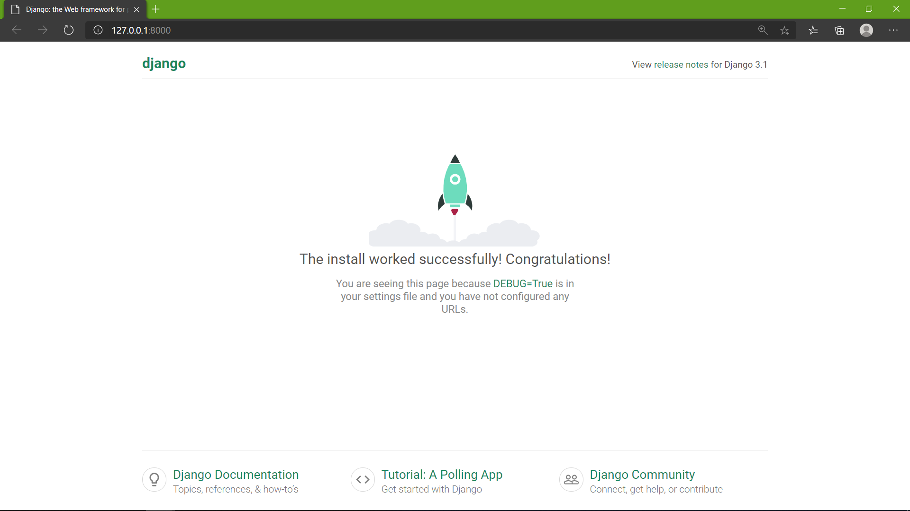

# Getting started

Table of Contents:

- [XAMPP](#xampp)
- [Node.js](#nodejs)
- [Django](#django)

## XAMPP

- ### Windows

  - **Step 1:** **[Download](https://www.apachefriends.org/download.html)** and Install XAMPP `Default installation directory- c:/xampp`.
  - **Step 2:** Open the XAMPP control panel and start the **`Apache module`**.
  
 
  - **Step 3:** Open any browser and go to the url: **[localhost](http://localhost)**
  

  - XAMPP for windows has been successfully installed :grinning:

- ### Linux

  Will be available soon

## Node.JS

Will be available soon

## Django

- ### Windows
  - Open Command Line or Windows Powershell and type bellow command 
  - **Step 1:** Install Virtual environment `pip install virtualenv env`.
  - **Step 2:** Once virtualenv is installed, you need to Activate it. For Activating Virtual Environment type –**`./env/Scripts/activate`**.


  - **Step 3:** After activating the Virtual Environment, we will install Django inside it. `pip install django`
    **Note - Django is installed in your virtualenv locally.**
  - **Step 4:** Start a django Project `django-admin startproject <project_name>`
  - **Step 5:** cd `<project_name>`
  - **Step 6:** That’s it, Now run the `python manage.py runserver`

  - **Step 7:** Open any browser and go to the url: **[http://127.0.0.1:8000](http://127.0.0.1:8000)**
    

  - Hurray! we have created the Django project and you will see the folder structure like this :grinning:
    ```
    └── env (All ENV File)
    ├── manage.py
    └── my_django_project
        ├── init.py
        ├── settings.py
        ├── urls.py
        └── wsgi.py
    2 directory, 5 files
    ```
  - To stop local server press CONTROL-C. Then you can exit your virtual environment using the command deactivate

- ### Linux
  - **Step 1:** We can install Python and Pip3 using following commands
    ```
      sudo apt-get install python3
      sudo apt-get install -y python3-pip
    ```
  - **Step 2:** Install Virtual environment `pip3 install virtualenv env`.
  - **Step 3:** Once virtualenv is installed, you need to Activate it. For Activating Virtual Environment type –**`. env/Scripts/activate`**.

  - **Step 3:** After activating the Virtual Environment, we will install Django inside it. `pip3 install django`
    - **Note** Installing Django in Virtual Environment is the recommended practice by Developers. 
  - **Step 4:** Start a django Project `django-admin startproject <project_name>`
  - **Step 5:** cd `<project_name>`
  - **Step 6:** That’s it, Now run the `python3 manage.py runserver`
  - **Step 7:** Open any browser and go to the url: **[http://127.0.0.1:8000](http://127.0.0.1:8000)**
  - Django project is successfully created. :grinning: