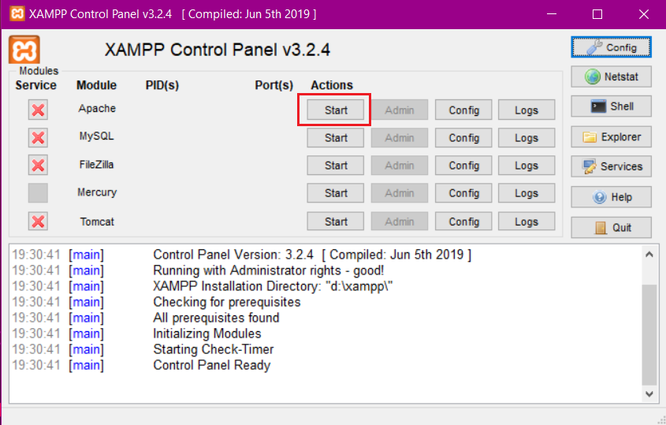
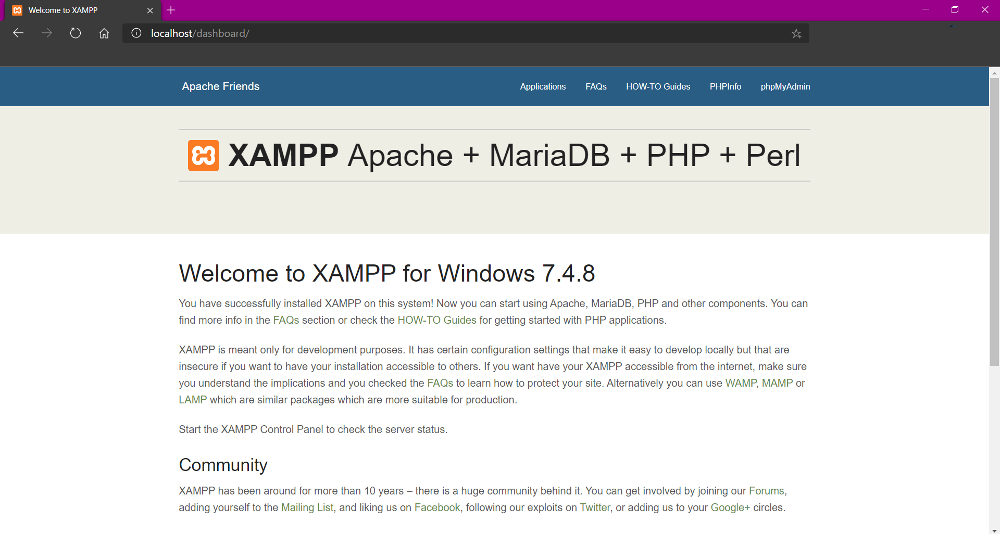

# Getting started

Table of Contents:

- [XAMPP](#xampp)
- [Node.js](#nodejs)
- [Django](#django)

## XAMPP

- ### Windows

  - **Step 1:** **[Download](https://www.apachefriends.org/download.html)** and Install XAMPP `Default installation directory- c:/xampp`.
  - **Step 2:** Open the XAMPP control panel and start the **`Apache module`**.
  
  - **Step 3:** Open any browser and go to the url: **[localhost](http://localhost)**
  
  - XAMPP for windows has been successfully installed :grinning:

- ### Linux

  Will be available soon

## Node.JS

Will be available soon

## Django

Will be available soon
